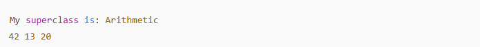

# Desafio de código para reforçar o conceito de herança utilizando java

O exercício "Java Inheritance II" envolve a criação de duas classes em Java:

1. Classe Arithmetic:
- Deve conter um método chamado add que recebe dois inteiros como parâmetros e retorna a soma deles.
2. Classe Adder:
- Esta classe herda de uma superclasse chamada Arithmetic.

### Exemplo de Saída:
Quando o código for executado, a saída esperada será:\

